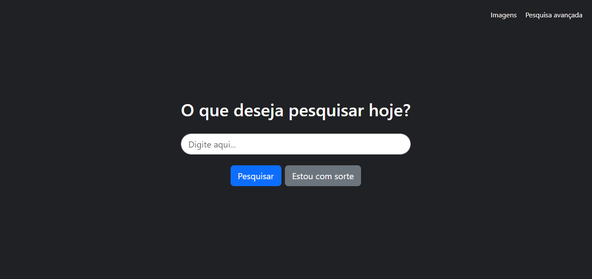

# Semana 0 - HTML, CSS
Neste projeto pude aplica revisar alguns conceitos de html e css e aplicar novos conhecimentos obtidos na primeira aula do curso "CS50’s Web Programming with Python and JavaScript".

Nos foi proposto a criação de 3 páginas (pesquisa, pesquisa de imagens, pesquisa avançada) com as funcionalidades do mecanismo de pesquisa do Google onde digitamos informações no formulário e ao enviar-mos somos direcionados para o resultado da pesquisa no próprio google.
Para isso precisei vericicar a url da página de pesquisa e identificar aquilo que de fato é importante para a exibição do resultado, ao identificá-los pude atribuí-los ao atributo "name" dos inputs.

Na aula pude conhecer e no projeto implementar tópicos como:
- Bootstrap
- Sass

## Visualização do projeto

